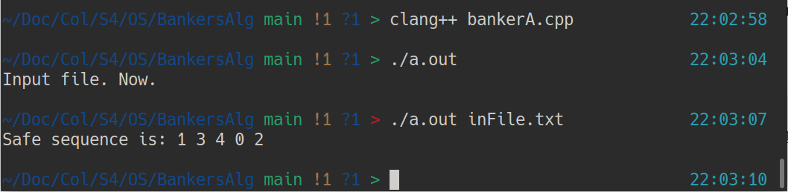

# The One and Only: Banker's Algorithm
The purpose of this algorithm is to ensure that there is a safe way to execute processes, so that there is no deadlock. Or, in the case of there not being a safe solution, report this.\
\
My implimentation went as such: I took in the values for all of my matrixes from a file. Next, I sent all of the matrixes into my checking function, which made a "needs" array. \
\
The calculations can be simply boiled down to this: take what you need, take the available resources, and apply the resources to the individual needs such that, by the end, all of them get done.\
## The Method to Run
Just compile the file and ./filename it.
## Examples

